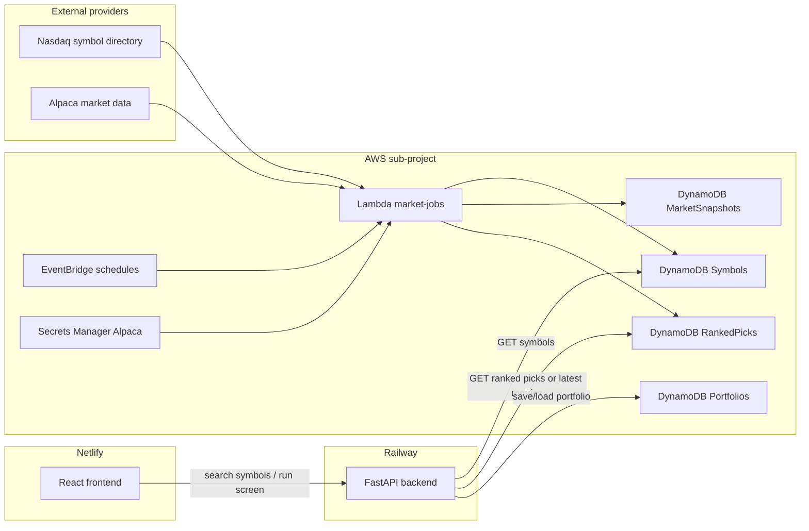

# AWS persistence and market jobs

This sub-project adds the persistent layer and scheduled background jobs while keeping the existing app shape:

- Frontend remains on Netlify.
- FastAPI remains on Railway.
- AWS stores shared symbol/portfolio/ranking data and runs scheduled refresh jobs.

## Why AWS here

For the current Railway + Netlify deployment, the most cost-effective persistent design is to keep the web/API where they are and add AWS only for durable state plus scheduled jobs:

- DynamoDB `PAY_PER_REQUEST` starts very cheap for small traffic.
- Lambda + EventBridge avoid always-on worker costs.
- Secrets Manager keeps data-provider credentials out of Railway and GitHub.
- Railway can later read the same DynamoDB tables via an IAM user/role or an AWS access key scoped to table access.

## Architecture



## Data responsibilities

| Data | Store | Refresh |
|---|---|---:|
| Available stock symbols | DynamoDB Symbols | Daily by default, up to `max_symbols_catalog` |
| Latest computed market metrics | DynamoDB MarketSnapshots | Every 15 minutes by default, up to `max_symbols_per_refresh` |
| Suggested ranked picks | DynamoDB RankedPicks | Every 15 minutes by default |
| User/session portfolios | DynamoDB Portfolios | On user save/load |

The symbol catalog should not carry live scores. Symbols are reference data. Scores come from the market snapshot and scoring jobs.

## Terraform resources

The Terraform stack creates:

- `be5g-stock-picker-prod-symbols`
- `be5g-stock-picker-prod-market-snapshots`
- `be5g-stock-picker-prod-ranked-picks`
- `be5g-stock-picker-prod-portfolios`
- one Python Lambda: `be5g-stock-picker-prod-market-jobs`
- EventBridge rules for symbol refresh, market refresh, and scoring
- Secrets Manager secret for Alpaca credentials
- optional GitHub Actions OIDC role
- optional least-privilege IAM user for the Railway API

## First deployment

```bash
cd infra/aws/terraform
cp terraform.tfvars.example terraform.tfvars
terraform init
terraform plan
terraform apply
```

After apply, set the Alpaca secret value:

```bash
aws secretsmanager put-secret-value \
  --secret-id "$(terraform output -raw alpaca_secret_arn)" \
  --secret-string '{"ALPACA_API_KEY":"your-key","ALPACA_API_SECRET":"your-secret"}'
```

## GitHub Actions deployment

Workflow: [../../.github/workflows/aws-infra.yml](../../.github/workflows/aws-infra.yml)

Required GitHub secret:

| Secret | Purpose |
|---|---|
| `AWS_ROLE_TO_ASSUME` | IAM role ARN used by GitHub Actions OIDC |

Optional GitHub secret:

| Secret | Default |
|---|---|
| `AWS_REGION` | `us-east-1` |

Bootstrap note: the OIDC role can be created by Terraform, but the very first apply still needs AWS credentials locally or an existing deploy role. Once Terraform outputs `github_actions_role_arn`, save that ARN as `AWS_ROLE_TO_ASSUME`.

## Railway API integration plan

The FastAPI code now supports local JSON or DynamoDB. Set these Railway environment variables after the AWS stack is deployed:

```text
SYMBOL_STORE_BACKEND=dynamodb
AWS_REGION=us-east-1
AWS_SYMBOLS_TABLE=<terraform output symbols_table_name>
AWS_PORTFOLIOS_TABLE=<terraform output portfolios_table_name>
AWS_ACCESS_KEY_ID=<access key for terraform output railway_api_iam_user_name>
AWS_SECRET_ACCESS_KEY=<secret access key>
```

Then:

- `/api/symbols` queries DynamoDB Symbols.
- `/api/portfolio` reads/writes DynamoDB Portfolios.
- `/api/screen` can later return precomputed RankedPicks with a visible `asOf` timestamp.

For suggested picks, prefer precomputed ranked picks for speed and cost, with a manual/live recompute path for paid users later.

Create the Railway API access key manually so the secret value does not land in Terraform state:

```bash
aws iam create-access-key \
  --user-name "$(terraform output -raw railway_api_iam_user_name)"
```
